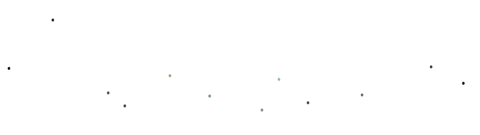

# [Путешествие по россии](https://leroxey.github.io/russian-travel/)   
В проекте используются множество вариантов выполнения верстки.
В отличие от предыдущей работы, эта страница адаптивная.
# Любому начинающему "веб-разработчику" будет очень полезно разобраться в данном коде и повторить его самостоятельно!!!

## Можно исправить!
  В блоке lead изображение "images/Group4.png" можно заменить на настоящий маршрут из яндекс карт.
  ```html
<section class="lead">
					<h1 class="lead__title">Путешествия по России</h1>
					<p class="lead__subtitle">Настоящая страна не в выпусках новостей, а здесь.</p>
					
					
					<p class="lead__caption">ваша полка — верхняя</p>
</section>
```
## Для работы с кодом вам потребуется:
1. Скачать архив.
2. Извлечь файлы на ваш компьютер.
3. Открыть их и начать работать (приятного времяпровождения)

